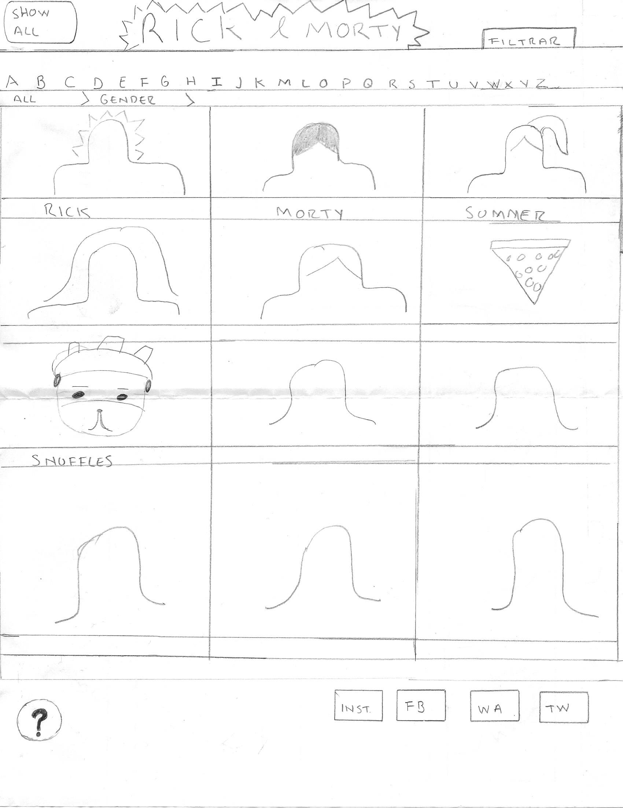

# Data Lovers: Rick & Morty

## Proceso de diseño
### Descubrimiento e investigación
#### Observación e investigación contextual
Rick & Morty es una serie de televisión estadounidense de animación para adultos de ciencia ficción creada por Justin Roiland y Dan Harmon para Adult Swim. Consta de tres temporadas, la primera se estrenó en diciembre de 2013 y la tercera concluyó en octubre de 2017. La cuarta temporada debutará en noviembre de 2019. 

La serie sigue las desventuras de un científico, Rick, y su no tan brillante nieto, Morty, quienes pasan el tiempo entre la vida doméstica y los viajes en el tiempo y universos paralelos.

De acuerdo a nuestra búsqueda en la web, al parecer la combinación de nihilismo alcohólico,referencias a la cultura popular,viajes en el tiempo y universos paralelos es bastante exitosa entre personas con un rango de edad de 18 a 34 años. Con cada temporada la audiencia de la serie no sólo se ha mantenido, sino que ha aumentado. 

En los últimos años los fans, hombres en su mayoría,de la serie han sido relacionados con comportamientos misóginos, violentos y con sentimientos de superioridad intelectual, derivado de la idea de quien debería ver una serie de ciencia ficción con lenguaje vulgar y violencia. A pesar de esto, de acuerdo con HULU, la fase de fans podría estar integrada por el 40 % de mujeres.

Referencias:

[Rick and Morty](https://en.wikipedia.org/wiki/Rick_and_Morty)

[Space Case: 'Rick and Morty' Reigns Supreme Over the 18-34 Demo](https://adage.com/article/media/rick-m/310745)

[Why Adult Swim's 'Rick and Morty' Is Millennials' Favorite TV Show](http://fortune.com/2017/09/30/why-adult-swims-rick-and-morty-is-millennials-favorite-tv-show/)

[Who exactly is watching 'Rick and Morty' on Hulu? The answer may surprise you](https://mashable.com/article/rick-and-morty-viewer-tends-demographics-hulu/)

[Inside the Toxic, ‘Intellectually Superior’ World of Facebook’s ‘Rick and Morty’](https://medium.com/s/darkish-web/inside-the-toxic-intellectually-superior-world-of-facebook-s-rick-and-morty-fans-4ede77fa1f8)

### Netnografía
Los sitios donde estudiamos a los fans de Rick & Morty fueron Facebook y Reddit, ya que ahí es donde se concentra la mayor actividad, Reddit más orientado al público anglosajón, y Facebook con una mayor cantidad de grupos en español y mexicanos.

Facebook

En Facebook principalmente hay noticias relacionadas con la serie, memes, fan art y mercancía oficial o no. También pueden encontrarse teorías y discusiones sobre la serie.

Reddit

Aquí puede encontrarse contenido similar, pero con mayores espacios para discutir teorías e interpretaciones.

De nuestra búsqueda en la web y netnografía de los fans, determinamos que Rick & Morty es una serie fuertemente autorefenciada con fans bastantes entusiastas, de la que hay que tener algo más del conocimiento básico para poder participar adecuadamente en los espacios de la comunidad de fans, sobre todo porque la muestra de desconocimiento, puede relacionarse con falta de entusiasmo, no ser un “fan verdadero”, o con no tener la inteligencia que se espera de un fan de Rick y Morty, que puede llevar a interacciones agresivas entre los miembros.

Para acortar a los usuarios de nuestra aplicación, saber más de sus comportamientos y entender sus necesidades, el siguiente paso fue realizar una encuesta.

### Encuesta
Se realizó el siguiente [cuestionario](https://forms.gle/NQMbQqdUc5wMXoweA), con el objetivo conocer los hábitos de audiencia de los fans de Rick & Morty, así como si buscan información sobre la serie (porqué, cómo y dónde). De la información que obtuvimos, lo que aprendimos fue lo siguiente:

Datos más relevantes
- La media de la edad de nuestros heavy users es entre 25 y 34 años. 
- La mayoría ha visto todas las temporadas y ha visto los capítulos por lo menos dos veces. 
- En general, no hay nada de la serie que los confunda, aunque sí suelen buscar información en fan pages y wikias. 
- Consideran que la información es fácil de encontrar en los sitios donde buscan cosas relacionadas a Rick & Morty. 
- Todos consideran que la información que encuentran es útil. 
- Sin embargo, una de las motivaciones de búsqueda es tener más claridad sobre la trama y los personajes. 
- En general, su búsqueda más frecuente son los personajes de Rick & Morty. 

## Síntesis y definición
De los datos que obtuvimos y analizamos en la fase de investigación, y que nos van a ayudar a desarrollar nuestra aplicación son:

Principales usuarios nuestro producto 
Personas de entre 18 a 24 años que han visto todas las temporadas de Rick & Morty, que suelen ver los capítulos más de una vez y que buscan información extra para tener más claridad sobre la serie.

Objetivos de estos usuarios con relación a nuestro producto
Ahondar en la trama y en los personajes. Seguir la serie con fidelidad. 

Datos más relevantes que quieren ver en la interfaz
Su búsqueda más frecuente son los personajes, por tanto, la información giraría en torno a ellos.

USER-PERSONA

Historia de usuario: Como viewer de Rick & Morty, quiero tener claras las características de los personajes y su relación con la trama. Necesito que la información esté organizada debidamente para saber en qué temporada y en qué capítulo aparece cada personaje, pues existen muchos giros en el guión que pueden restar claridad sobre el origen de cada uno. 

Datos personales:
Alejandro tiene 25 años, es profesionista y trabaja todo el día. Está soltero.
Aunque se siente cómodo con su situación laboral, constantemente reflexiona sobre sus metas y sus aspiraciones, pues no le gusta sentirse atrapado. 

Datos de su desarrollo profesional: Es profesionista

Datos comportamiento digital: El internet es el corazón de su trabajo, pues lo considera una herramienta esencial sin la cual no podría completarlo. Así mismo, suele pasar varias horas en internet en sus ratos libres, en redes sociales y en youtube. También suele utilizar internet para ver series.

## Ideación y prototipado
Prototipo de baja fidelidad

[README original](READMEoriginal.md)
